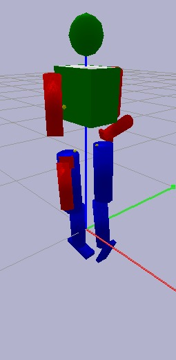
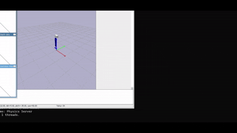

# 🤖 Humanoid_Agent_

A modular, extensible project for **humanoid pose extraction**, **image processing**, and experimental **agent pipelines**.  
Includes utilities for reading images, extracting pose/keypoints, saving output visualizations, and running custom agent logic.

---

## 🎥 Demo & Output Samples


###  Example Input vs Output 

| Input Image | Processed Output |3D Pybullet Model
|-------------|------------------|------------------|
|  |  |

 
### 🎞️ Animation / GIF (Pose Overlay, Pipeline, Motion)




---

## 📌 Overview

This repository contains:

- A clean image → pose keypoints → output pipeline  
- Modules for pose extraction (extendable to MediaPipe, OpenPose, custom models, or RL agents)
- Organized project layout for easy experimentation  
- Support for saving processed images, visualizations, and animations  

Use this repo as a base for:

- Pose extraction  
- Skeleton-based animation  
- Preprocessing for reinforcement learning humanoid agents  
- Research projects or demos  

---

## 📂 Repository Structure
```
Humanoid_Agent_/
│
├── Module1_2_new/              # Main source code (pose extraction, image pipelines)
│   ├── module.py
│   ├── humanoid_env.py
|   |── test_full.py
│   └── test_module1.py
│
├── Test_images/                # Raw input images
│   ├── test.jpg
│   ├── test2.jpg
│   └── ...
│
├── final_outputs_2/            # Processed outputs (images, overlays, results)
│   ├── output_test.jpg
│   └── ...
│
│
├── assets/ humanoid_10theta.urdf                   # Models, configs, weights (if needed)
│
├── requirements.txt
├── .gitignore
└── README.md
```

---

## 🛠️ Installation

### 1️⃣ Clone the repository
```bash
git clone https://github.com/Saranya625/Humanoid_Agent_.git
cd Humanoid_Agent_
```

### 2️⃣  Create a virtual environment
```bash
python -m venv venv
source venv/bin/activate       # Linux/Mac
# OR
venv\Scripts\activate          # Windows
```

### 3️⃣ Install dependencies
```bash
pip install -r requirements.txt
```

---

### How to run ?
```bash
python Module1_2_new/pose_extractor.py --input Test_images/test.jpg --output final_outputs_2/output_test.jpg
```


*(Use only the scripts that exist; add rest when created.)*

---

## 🧩 Features

- **Modular Architecture**: Easy to extend with new pose extraction methods or agent logic
- **Multiple Input Formats**: Support for various image formats (JPG, PNG, etc.)
- **Visualization Tools**: Built-in utilities for overlay rendering and animation generation
- **Batch Processing**: Process multiple images efficiently
- **Extensible Pipeline**: Add custom preprocessing, postprocessing, or agent modules

---

## 📦 Dependencies

Main dependencies include:

- `opencv-python` - Image processing and visualization
- `numpy` - Numerical operations
-  `openpose` - Pose estimation (depending on implementation)
---


